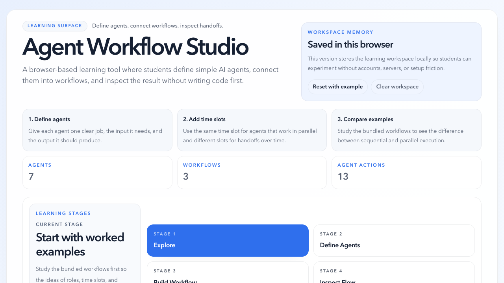

# agentic-workflow-simulator

`agentic-workflow-simulator` is a browser-based learning tool for university students who are new to programming but need to understand how agents and agent workflows work.

Instead of starting from code, students can define agents in plain language, connect them into workflows, and inspect how work moves from one agent to the next over time.

## What the app does

- Define agents with a clear job, input, and output.
- Build workflows with explicit time slots and handoffs.
- Show sequential and parallel execution patterns.
- Visualize flow through playback cards and an animated DAG-style graph.
- Simulate packet flow locally with deterministic mock data.
- Save everything in the browser so students can experiment without accounts or backend setup.

## Why it exists

The project is designed as a teaching surface first.

It aims to help students:

- understand what an agent receives and returns
- see how multi-agent workflows are structured
- compare sequential and parallel work
- inspect how handoffs affect downstream steps
- experiment safely without needing to write code first

## Quick start

1. Install dependencies with `npm install`.
2. Start the local app with `npm run dev`.
3. Open `http://127.0.0.1:8787`.

## Read more

- Setup, commands, verification, and project structure: `docs/development.md`
- Feature behavior and UI contract: `specs/agent-workflow-studio/spec.md`
- Architecture decisions: `docs/adrs/README.md`
- Repo-wide agent instructions: `AGENTS.md`
